# Praca na zajęciach
- 4 zadania, tylko 3 obowiązkowe
- Korzystamy z oprogramowania **Multisim 14.3 Education**
  - Kod licencyjny: D11L1095576 (jest też na Panel AGH)
- Na zajęciach będziemy wykorzystywać sygnały TTL (5V)

# Elektronika
- Pozostałość po nieistniejącym przedmiocie, będzie chyba tylko przez pierwszy wykład
- Później będzie faktyczna technika cyfrowa (tranzystory and stuff)
## Napięcie, moc, energia
- Oznaczenie źródla napięcia w obwodzie:  
 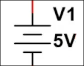
- Oznaczenie rezystora: 
 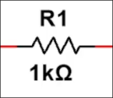  
jest to standard amerykański, my będziemy używać właśnie tego i taki mamy wybrać w oprogramowaniu, o którym mowa jest wyżej
- Prawo Ohma:  
 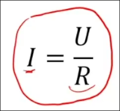 
Wynika z niego między innymi, że rezystencja nie może być równa 0, nie należy też zwierać obwodu, ponieważ grozi to pożarem
- Prawo Kirhoffa
  - Suma napięć w obwodzie = 0. Napięcie o "zwrocie" przeciwnym do napięcia wytwarzanego przez baterię powstaje na rezystorach
  - Suma prądów wychodzących z węzła jest równa prądowi wpływającymu do węzła
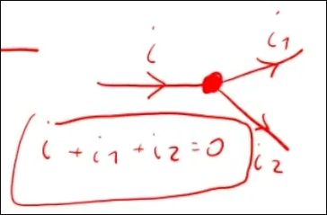

- Wzory na moc  
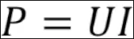  
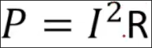
  
### Alternatywna forma przedstawienia układów (nie jako obwód zamknięty):  
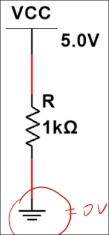

### Rodzaje prądu
- Prąd stały
- Prąd zmienny  
  - Prąd zmienny znajdziemy w sygnałach zegarowych, czyli w sygnałach wytwarzanych przez układy cyfrowe   
   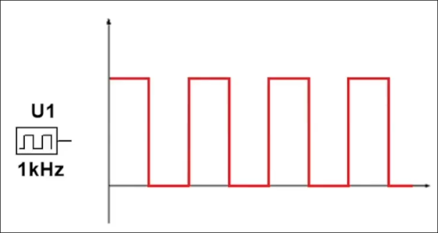 
  - W energetyce prąd zmienia się sinusoidalnie   
  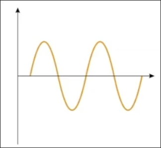

### Rezystory
- Oznaczenie jest omówione wyżej
- Znaczenie kolorów na rezystorze:   
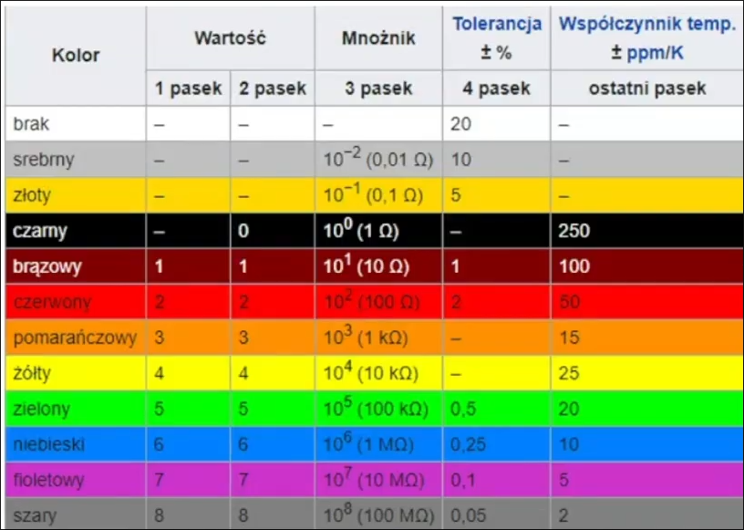  

- Łączenie rezystorów
  - Szeregowe (po sobie), daje sumę rezystencji
  - Równoległe (po rozgałęzieniu), daje opór wyrażony wzorem:  
  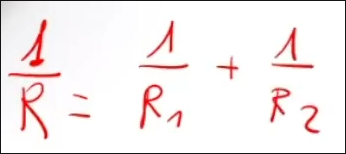
  
  
- Potencjometr (rezystor zmienny) 
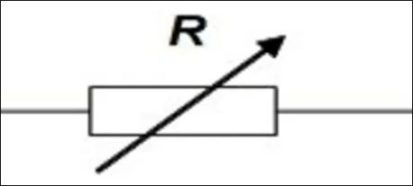  

- Fotorezystor  
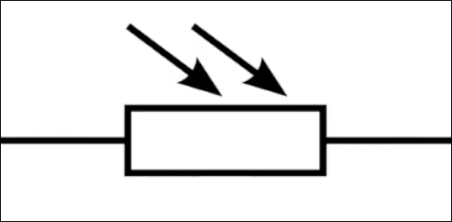  

- Termistor (rezystor termiczny)
  - NTC — rezystencja maleje wraz ze wzrostem temperatury
  - PTC — rezystencja rośnie wraz z temperaturą
  - CTR - Rezystencja nagle maleje przy bardzo konkretnej temperaturze (mogą być używane jako element bezpieczeństwa)

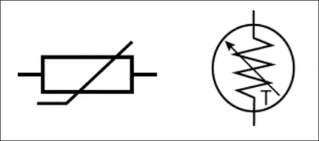

**APPARENTLY TEGO WSZYSTKIEGO NIE TRZEBA WIEDZIEĆ XD**

- Kondensator
  - Bateria, którą można bardzo szybko naładować i rozładować
  - Używany do stabilizacji napięcia w układach  
  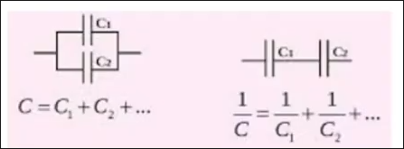  
  - Można spotkać kondensator o zmiennej pojemności  
  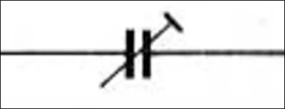  

- Diody — układ, który przewodzi prąd w tylko jednym kierunku  
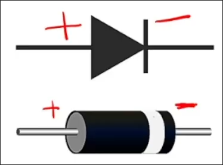

- Tranzystory
  - Układ pozwalający na sterowanie obwodami za pomocą innych obwodów
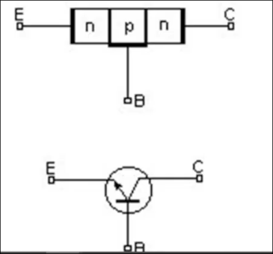
## Podstawy techniki cyfrowej

### Standard TTL
- Obowiązują konkretne poziomy napięcia dla różnych zastosowań

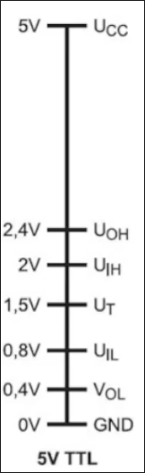
- Ucc = napięcie zasilania
- gnd = ground
- o = output
- i = input
- H = high
- L = low

Low oznacza logiczne 0, a high oznacza logiczne 1

Trzeba uważać na to, że tolerancje napięcia wsą inne na wejściu na wyjściu

## Zapis logiczny obowiązujący na zajęciach

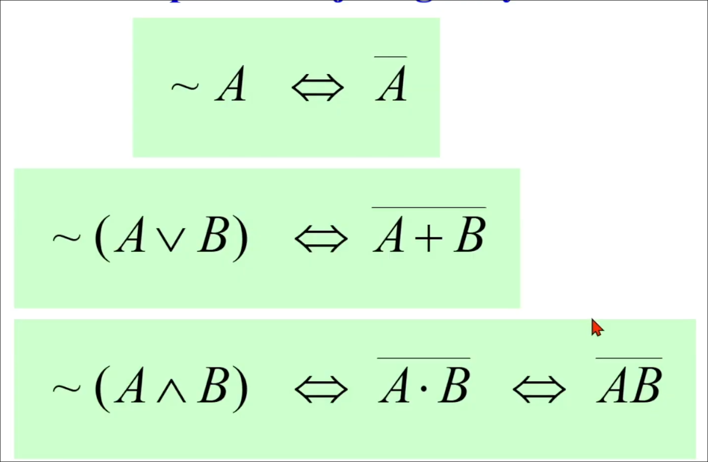

